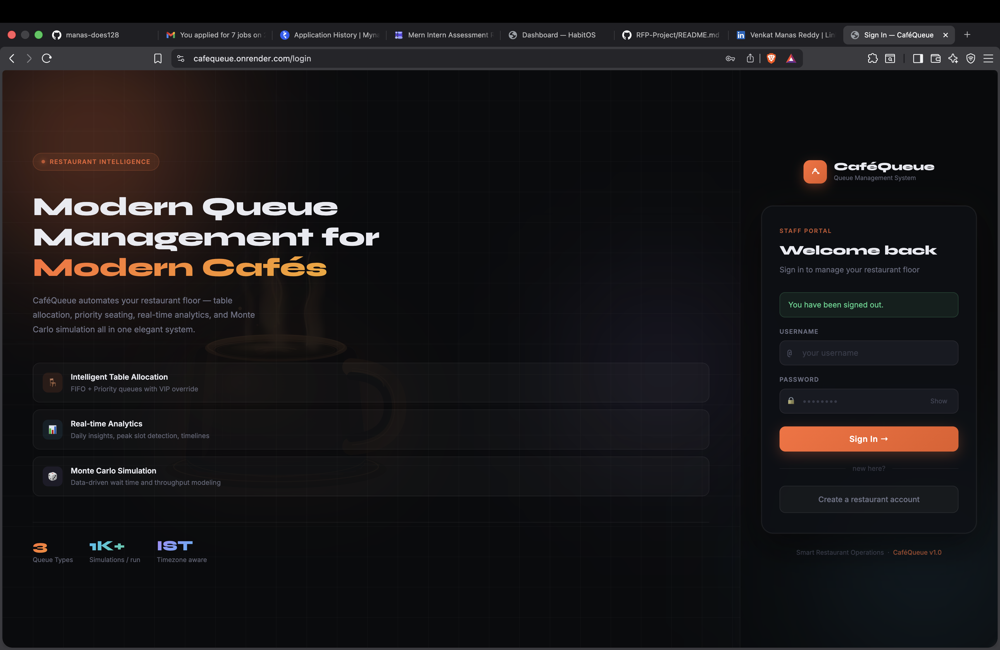
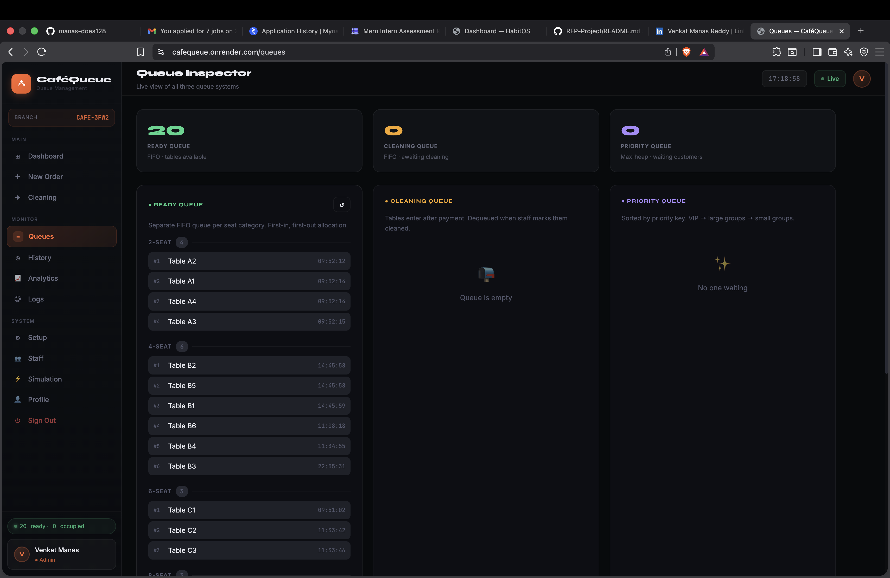

<div align="center">

# ☕ CaféQueue

### Intelligent Restaurant Queue & Analytics Platform

Real-time queue management, smart table allocation, live analytics, and Monte Carlo simulation — engineered for modern cafés and restaurants.

<br>


*Real-time restaurant operations powered by queue intelligence, analytics and simulation.*

</div>

---
## ⚡ Platform Highlights

🧠 Smart Table Allocation  
📊 Real-Time Analytics  
🎲 Monte Carlo Simulation  
⚡ Live Queue Management  
🔐 Role-Based Authentication  

---
<div align="center">

# ✨ Product Showcase

## 🔥 Premium Login Experience
<p align="center">
  
</p>

<p align="center">
<i>Elegant authentication portal with futuristic typography and premium dark aesthetics.</i>
</p>

---

## 📊 Live Operations Dashboard
<p align="center">
  
</p>

<p align="center">
<i>Monitor restaurant activity, live tables, orders and operational flow in real time.</i>
</p>

---

## 🧠 Queue Intelligence Engine

<table>
<tr>
<td width="50%">

### Queue Inspector

Multi-queue architecture featuring:

✔ Ready Queue (FIFO)  
✔ Cleaning Queue  
✔ VIP Priority Queue  
✔ Smart Allocation Logic  



</td>

<td width="50%">

### Smart Restaurant Setup

Configure seating layouts with:

✔ Live Preview  
✔ Capacity Breakdown  
✔ Presets  
✔ Initialization Workflow  


</td>
</tr>
</table>

---

## 📈 Real-Time Analytics

<p align="center">
  
</p>

<p align="center">
<i>Traffic trends, peak-hour detection and operational intelligence powered by live data.</i>
</p>

---

## 🎲 Monte Carlo Simulation

<p align="center">
  
</p>

<p align="center">
<i>Predict wait times, throughput and occupancy using historical restaurant behavior.</i>
</p>

---

## ⚡ Traffic Intelligence

<p align="center">
  
</p>

<p align="center">
<i>30-minute interval traffic timelines reveal real customer behavior and rush-hour dynamics.</i>
</p>

---## 📑 Table of Contents

- [📸 Preview](#-preview)
- [🚀 Key Features](#-key-features)
- [📊 Analytics & Insights](#-analytics--insights-new)
- [🎲 Monte Carlo Simulation](#-monte-carlo-simulation-new)
- [⚙️ Queue Algorithms](#️-queue-algorithms)
- [🛠 Tech Stack](#-tech-stack)
## 🚀 Key Features

# 🚀 Core System & Intelligence

## 🧠 Queue Intelligence Engine

<table>
<tr>
<td width="50%">

### Queue Inspector
Multi-queue architecture with:

✔ Ready Queue (FIFO)  
✔ Cleaning Queue  
✔ Priority Queue (VIP + size-based)


</td>

<td width="50%">

### Smart Restaurant Setup
Configure seating layouts and initialize operations with live preview.


</td>
</tr>
</table>

---

## 📈 Real-Time Analytics

Advanced operational intelligence powered by real restaurant data.

<table>
<tr>
<td width="50%">

### Daily Analytics
Customer trends, peak-hour detection and traffic curves.


</td>

<td width="50%">

### Analytics Dashboard
Date-wise operational insights and business intelligence.


</td>
</tr>
</table>

---

## 🎲 Monte Carlo Simulation

Predict restaurant performance using historical operational patterns.


---
### 🎨 UI/UX Enhancements
- Premium dark theme
- Glassmorphism cards
- Futuristic login typography (custom font)
- Smooth hover + transitions
- Clean dashboard layout

---

## 📸 Pages Overview

| Page | URL | Purpose |
|---|---|---|
| Dashboard | `/` | Live stats, table map, active orders |
| Orders | `/orders` | Place orders & allocate tables |
| Cleaning | `/cleaning` | Manage cleaning workflow |
| Queues | `/queues` | View all queues |
| Analytics | `/analytics` | Data insights & trends |
| History | `/history` | Order history |
| Logs | `/logs` | System audit logs |
| Setup | `/setup` | Initialize tables |
| Users | `/users` | Admin user management |
| Login | `/login` | Authentication |
| Register | `/register` | Create account |

---

# 🧠 Queue Architecture

CaféQueue uses a multi-queue architecture designed for intelligent restaurant operations and efficient customer handling.

<table>
<tr>
<td width="33%">

## Ready Queue

FIFO queue organized by seat category.

- Exact seating match
- Fast allocation
- Auto refill after cleaning

</td>

<td width="33%">

## Cleaning Queue

Dedicated FIFO cleaning workflow.

- Triggered after payment
- Cleaning lifecycle tracking
- Auto transition to ready state

</td>

<td width="33%">

## Priority Queue

Priority-based allocation engine.

- VIP customers
- Large groups prioritized
- FIFO inside same priority

</td>
</tr>
</table>

---

# ⚙️ Smart Allocation Logic

CaféQueue follows a layered allocation strategy:

```text
Customer Arrival
        ↓
Priority Evaluation
        ↓
Exact Table Match
        ↓
Next Best Fit Allocation
        ↓
Queue Placement
        ↓
Dining → Cleaning → Ready Queue
```

This workflow minimizes wait times and improves operational efficiency.

---
---

# 🛠 Tech Stack

| Layer | Technology |
|---|---|
| Backend | Flask (Python 3.10+) |
| Database | MongoDB + PyMongo |
| Frontend | HTML5, CSS3, Vanilla JS |
| Authentication | Session-based + SHA-256 hashing |
| Analytics | Custom aggregation + Monte Carlo simulation |

---

# 🚀 Run Locally

Clone the project:

```bash
git clone <repo-url>
cd CafeQueue
pip install -r requirements.txt
```

Configure environment variables:

```env
MONGO_URI=your_mongodb_uri
SECRET_KEY=your_secret_key
FLASK_ENV=development
```

Run:

```bash
python app.py
```

Open:

```text
http://localhost:5000
```

---

# ☕ Final Note

Built with Flask, MongoDB and systems-thinking for smarter restaurant operations.

---
